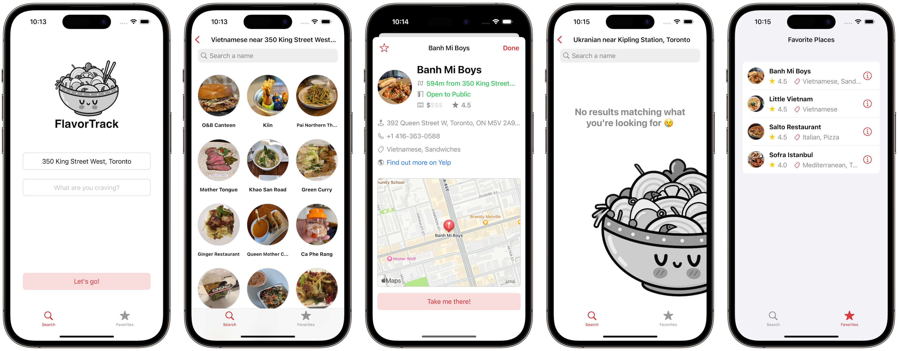

# FlavorTrack🍜

## Context
I built FlavorTrack to mimic an iOS take-home project, completing all stages including brainstorming, planning, developing, and optimizing within 3-4 days as per an employer's expectations.

## App Idea
FlavorTrack is an iOS mobile app that helps users browse nearby F&B outlets, provides detailed information and mark their favorites. FlavorTrack makes it easy to discover new and delicious places to eat, and keeps track of favorite spots.

I enjoy walking for better health and saving money. So I want FlavorTrack app to help me find places within a 2.5 km radius (or 30 minute walk, not too far away) from my location.

The app uses data provided from Yelp, and results fetched are sorted by distance.

## Concepts
<table>
    <thead>
        <tr>
            <th>Concept</th>
            <th>Details</th>
        </tr>
    </thead>
    <tbody>
        <tr>
            <td>MVC</td>
            <td>Model, UI components, and controllers are separated</td>
        </tr>
        <tr>
            <td>Programmatic AutoLayout</td>
            <td>UI components and constraints are 100% in programmatic code as I think it's good for code maintenance and ease of change</td>
        </tr>
        <tr>
            <td>Separation of concerns</td>
            <td>In addition to MVC modules, supporting ones (API, data fetching, persistence, extensions, etc. are also neatly structured for project readability amnd maintainability</td>
        </tr>
        <tr>
            <td>Custom UI</td>
            <td>UI components (alert banners, buttons, text labels, etc.) customized on top of Apple APIs to keep inbuilt support for a familiar systemwide iOS look</td>
        </tr>
        <tr>
            <td>Accessbility</td>
            <td>Integrate accessibility considerations in the development of complex views with custom UI components</td>
        </tr>
        <tr>
            <td>Delegate</td>
            <td>Delegate pattern is implemented for clear and concise one-to-one communication between view controllers. At the moment, this is portrayed in "BusinessInfoVC" to direct users to the Maps app.</td>
        </tr>
        <tr>
            <td>Completion handler & async/await</td>
            <td>Typical networking completion handlers and their async/await versions are both available in data service classes. Therefore the app is optimized for iOS versions before 14.0, as well as 15.0 and later</td>
        </tr>
        <tr>
            <td>Image caching</td>
            <td>To help save API consumption count, network calls, and battery consumption, I utilized iOS image caching when downloading picture data.</td>
        </tr>
        <tr>
            <td>MapKit & Domain Model Conversion</td>
            <td>Apple MapKit API is implemented to show businesses on a map, so users who are visual like me would appreciate the intuition this provides</td>
        </tr>
    </tbody>
</table>

## Challenges Overcome
Throughout the development of this project, I encountered several challenges that required innovative solutions. With determination and critical thinking, I was able to overcome them and deliver a robust, functional outcome.

Below are some biggest challenges I faced:
<table>
    <thead>
        <tr>
            <th>Challenge</th>
            <th>Details & How I overcame it</th>
        </tr>
    </thead>
    <tbody>
        <tr>
            <td>Domain model not MapKit-compatible</td>
            <td>The Yelp JSON API is well-structured, but it does not work with iOS MapKit without modification. I spent 30 minutes researching how to use MapKit with a model class before realizing that an intermediary model class was the solution for converting the "Business" type to "MKAnnotation" conformance.</td>
        </tr>
        <tr>
            <td>Delegation</td>
            <td>I considered where to delegate responsibilities and which view controller should conform to the delegate and host the implementation code. I ultimately decided that the "BusinessInfoVC" was the best choice, with considerations for separation of concerns described in the "What Would I Change" section.</td>
        </tr>
        <tr>
            <td>Distance From Location</td>
            <td>I intended for the project to function based on manual location input, not GPS. As a result, the distance information returned from Yelp could be confusing to users if they thought it was updated dynamically as they moved. This issue could be exacerbated by the lack of location persistence across app launches.\nTo address this, I decided to display "X meters away from 123 This Street" when the user is in search mode, and "X meters away from searched location" when in persistent mode.</td>
        </tr>
    </tbody>
</table>

## What Would I Change
<pre>under construction, to be live soon</pre>
implement realtime GPS parsing and refetch data, but it could cost more API consumption limit
generic types for data fetching and persistence
abstraction for decoupled code and extensibility
core data caching so the app remains useable even when offline
unit tests
figure a good way to display cost info with good accessibility support

## Screenshots
